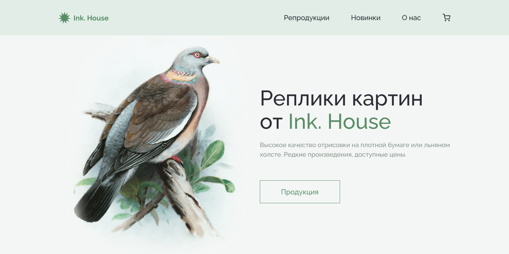

# Учебный проект: вёрстка лендинга для магазина картин Ink. House

Сложность: *лёгкая*

Макет взят с сайта [verstaem.online](https://verstaem.online/projects/house/)

Ссылка на макет: [Figma](https://www.figma.com/file/SjHvI8W1yzwJjzyUrCPpsI/House?type=design&node-id=3%3A838&t=VZiVKXvlLixjtJN8-1)

Реализованная работа: [Ink. House](https://aleksandrvishniakov.github.io/LearningWebProjects/InkHouse/index.html)

## Технологии
- HTML
- [SASS](https://sass-lang.com/)
- JavaScript
- методология [БЭМ](https://ru.bem.info/methodology/html/)
- адаптивная вёрстка